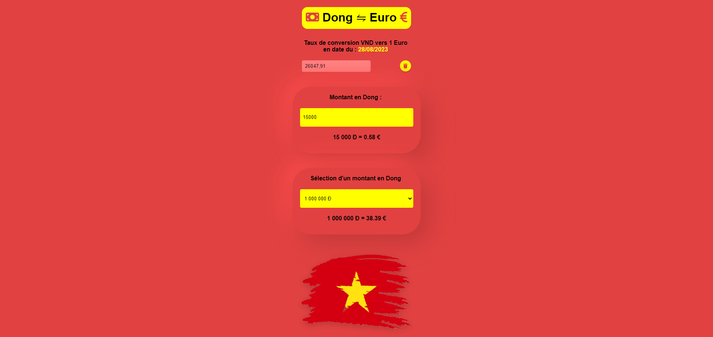

# Convertisseur Dong vers Euro

Le Convertisseur Dong vers Euro est un outil simple qui vous permet de convertir des montants en Dong vietnamien (VND) en Euro (EUR) sans avoir besoin d'une API externe. Ce convertisseur offre également la flexibilité de modifier manuellement le taux de conversion pour répondre à vos besoins.

## Fonctionnalités

- Conversion rapide et facile du Dong vers l'Euro.
- Pas d'API externe.
- Possibilité d'ajuster manuellement le taux de conversion.
- Aux couleurs du VN

**Note :** Les taux de change varient avec le temps. Assurez-vous de garder votre taux de conversion à jour pour obtenir des résultats précis.

**Avertissement :** Ce convertisseur est à des fins éducatives uniquement et ne garantit pas l'exactitude des taux de change utilisés. Les taux de change réels peuvent varier. Utilisez les résultats du convertisseur avec discernement et ne vous fiez pas uniquement à eux pour prendre des décisions financières.

 
[Merci d'utiliser le Convertisseur Dong vers Euro !](https://brival-m.github.io/DongToEuro/)
